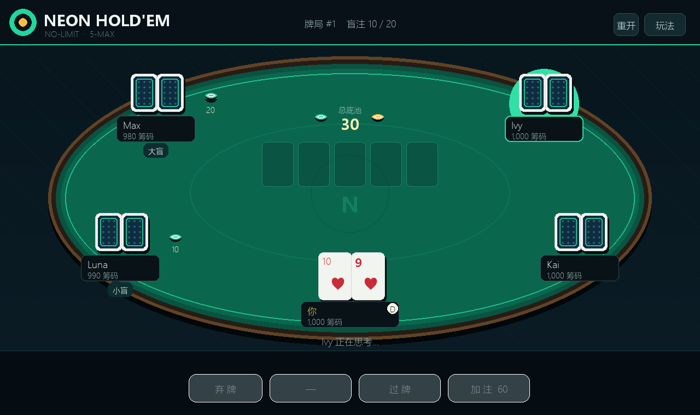

# Neon Hold'em 德州扑克

一款使用 Python 与 Pygame 制作的单机德州扑克游戏。玩家在五人桌上对战四名不同风格的 AI，包含随机洗牌、完整下注流程、全下和边池结算。



## 下载游玩

Windows 用户可在 [Releases](https://github.com/tzt302/game_poker/releases/latest) 下载 `Neon-Holdem-Windows.zip`，解压后双击 `NeonHoldem.exe`，无需安装 Python。

## 游戏功能

- 标准 52 张牌随机洗牌，每手牌重新发牌
- 5 人牌桌：玩家与 4 名不同性格的 AI
- 庄家、小盲、大盲依次轮转
- 翻牌前、翻牌、转牌、河牌及摊牌完整流程
- 过牌、跟注、加注、全下、弃牌
- 牌型比较、平分底池及边池结算
- 可缩放窗口、筹码动画、行动提示和快捷键

## 源码运行

```powershell
python -m pip install -r requirements.txt
python poker.py
```

也可以双击 `start_game.bat`，脚本会检查并安装 Pygame，然后启动游戏。

## 操作

| 操作 | 鼠标 / 键盘 |
| --- | --- |
| 过牌或跟注 | 点击按钮、`C` 或空格 |
| 弃牌 | 点击按钮或 `F` |
| 加注 | 拖动加注条后点击按钮、`R` 或回车 |
| 下一手 | 点击“再来一手”或 `N` |
| 帮助 | 右上角“玩法”或 `H` |
| 退出 | `Esc` |

## 测试

```powershell
python -m unittest discover -s tests -v
```

## 构建 Windows 版本

```powershell
python -m pip install pygame pyinstaller
pyinstaller --noconfirm --clean NeonHoldem.spec
```

构建结果位于 `dist/NeonHoldem/`。
